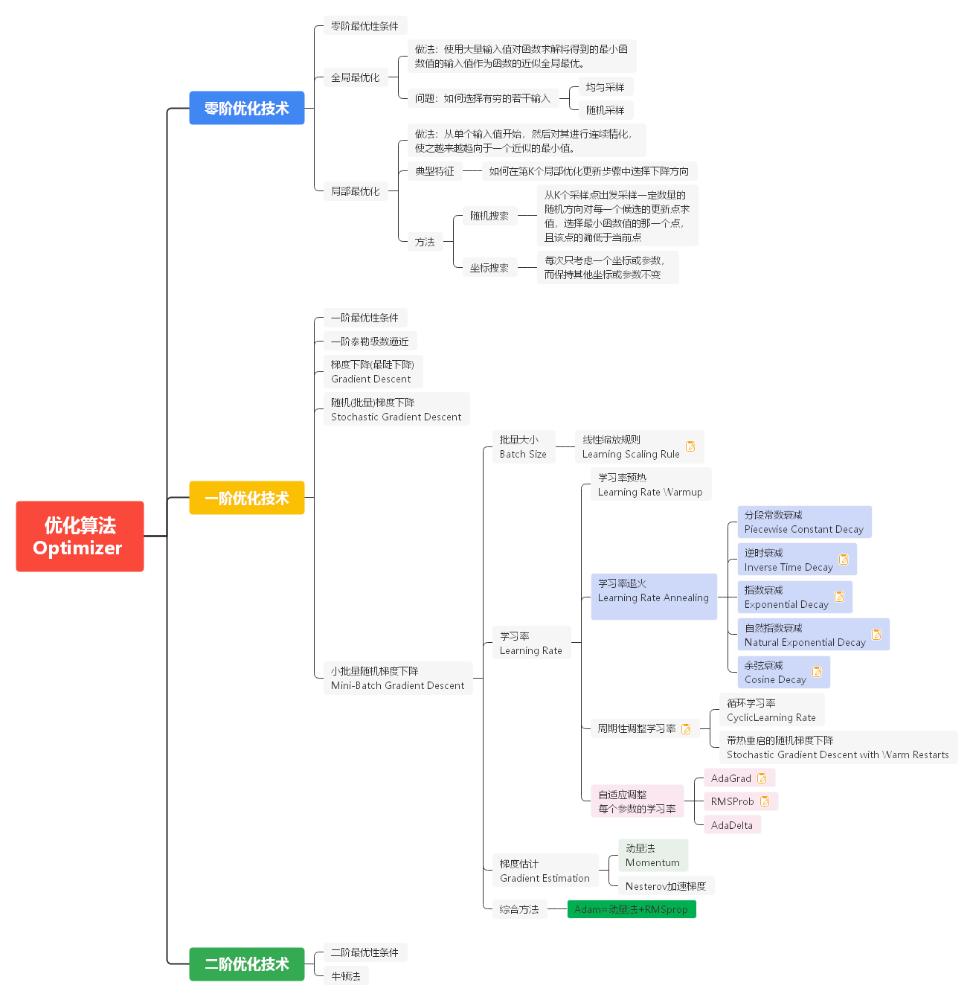

# Machine-Learning


## Demo
```
var pr = new MLNet.Models.Regression.PolyRegression();
var trainPlan = new TrainPlan(100, learningRate: 1E-1);

pr.GiveOptimizer(new InverseTime(trainPlan.LearningRate));
pr.GiveLoss(new LSLoss {Constraint = Constraint.Ridge});
pr.GiveMetric(new MSE(), new MAE());
pr.Fit(X, Y, trainPlan);
```


## Frame





